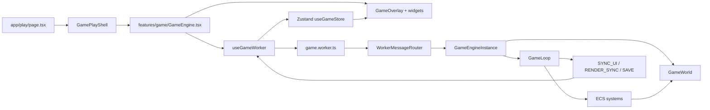

# 아키텍처

---
status: canonical
owner: engineering
last_reviewed: 2026-05-16
source_paths:
  - .agents/rules/08-agents.md
  - src/app/play/page.tsx
  - src/app/_components/GamePlayShell.tsx
  - src/features/game/GameEngine.tsx
  - src/features/game/hooks/useGameUI.ts
  - src/features/game/hooks/useGameWorker.ts
  - src/features/game/worker/game.worker.ts
  - src/features/game/worker/WorkerMessageRouter.ts
  - src/features/game/worker/GameEngineInstance.ts
  - src/features/game/ecs/systems/GameLoop.ts
  - src/entities/world/model.ts
  - src/shared/types/worker.ts
  - src/shared/lib/store.ts
---

## 목적

이 문서는 Drilling RPG의 코드 레이어, 메인 스레드/워커 경계, 런타임 데이터 흐름을 설명합니다. 세부 수치와 콘텐츠 데이터는 `GAME_CONSTANTS.md`, `GAME_DATA_MODEL.md`를 기준으로 하고, 렌더링/저장/게임 루프의 상세 절차는 별도 문서로 분리합니다.

## 전체 구조



핵심 경계는 `GameEngine.tsx`와 `game.worker.ts` 사이입니다. React UI와 브라우저 API 중심 처리는 메인 스레드에서 담당하고, 게임 시뮬레이션과 PixiJS 렌더링 초기화는 워커 쪽 `GameEngineInstance`와 `GameLoop`가 담당합니다.

## FSD 레이어

`.agents/rules/08-agents.md` 기준으로 프로젝트는 Feature-Sliced Design 형태를 따릅니다.

| 레이어 | 경로 | 책임 |
|---|---|---|
| `app` | `src/app` | Next.js 라우팅, 레이아웃, 페이지 엔트리 포인트입니다. |
| `widgets` | `src/widgets` | 인벤토리, 상점, 제작, 상태창, 가이드처럼 여러 기능을 조합한 UI 블록입니다. |
| `features` | `src/features` | 게임 엔진 브리지, 입력 처리, ECS 시스템처럼 실제 기능 단위 동작을 담당합니다. |
| `entities` | `src/entities` | `Player`, `TileMap`, `GameWorld`처럼 핵심 도메인 상태와 생성 함수를 담습니다. |
| `shared` | `src/shared` | 설정, 타입, 저장소, 공용 UI, 공용 유틸리티를 담습니다. |

레이어 의존성은 상위에서 하위로 흐르는 것을 원칙으로 합니다. 예를 들어 `features/game`은 `entities/world`와 `shared/types`를 참조할 수 있지만, `shared`가 `features`의 구체 시스템을 알아서는 안 됩니다.

## 앱 진입 흐름

| 단계 | 파일 | 역할 |
|---|---|---|
| 1 | `src/app/play/page.tsx` | `/play` 페이지 엔트리입니다. `GamePlayShell`을 렌더링합니다. |
| 2 | `src/app/_components/GamePlayShell.tsx` | 전체 화면 shell을 구성하고 `GameEngine`을 포함합니다. |
| 3 | `src/features/game/GameEngine.tsx` | canvas, overlay UI, 에셋 로딩, 워커 연결, 메인 스레드 보간 루프를 관리합니다. |
| 4 | `src/features/game/hooks/useGameWorker.ts` | Worker 생성, 메시지 검증, save load, Zustand 동기화, render sync buffer 반환을 담당합니다. |
| 5 | `src/features/game/worker/game.worker.ts` | 워커 진입점입니다. PixiJS Web Worker adapter를 설정하고 메시지 라우터를 연결합니다. |

`GameEngine.tsx`는 React 컴포넌트지만 직접 게임 시뮬레이션을 돌리지 않습니다. 메인 스레드에서 하는 일은 에셋 fetch, `ImageBitmap` 생성, `OffscreenCanvas` 전달, UI overlay 렌더링, 워커에서 온 상태를 화면에 반영하는 것입니다.

## 메인 스레드와 워커 경계

| 영역 | 메인 스레드 | 워커 스레드 |
|---|---|---|
| 진입점 | `GameEngine.tsx`, `useGameWorker.ts` | `game.worker.ts`, `WorkerMessageRouter.ts` |
| 상태 | Zustand `useGameStore`, React local state, render interpolation snapshot | `GameWorld`, `TileMap`, `EntityManager`, `SpatialHash`, `GameLoop` |
| 렌더링 | DOM overlay, HUD, modal widgets, canvas element 소유권 전달 | PixiJS app/layers 초기화, tile/entity/effect 렌더 시스템 |
| 입력 | keyboard/mobile input 수집, worker message 전송 | `inputSystem`, `physicsSystem`, action 처리 |
| 저장 | LocalStorage/IndexedDB 저장 실행, clipboard export | 저장 payload 생성, tile map buffer serialize |
| 사운드/UI 요청 | Zustand와 SFX manager 호출 | `PLAY_SFX`, `SHOW_TOAST`, `OPEN_MODAL`, `TUTORIAL_TRIGGER` 메시지 발행 |

메인 스레드는 고빈도 게임 상태를 직접 소유하지 않습니다. 워커가 `RENDER_SYNC`로 전송한 `ArrayBuffer` 스냅샷을 메인 스레드가 보간해 HUD 위치와 화면 표시를 부드럽게 맞춥니다.

## 메시지 계약

메시지 타입과 런타임 검증 함수의 정본은 `src/shared/types/worker.ts`입니다.

| 방향 | 타입 | 용도 |
|---|---|---|
| Main -> Worker | `INIT` | seed, save data, tile map buffer로 월드를 초기화합니다. |
| Main -> Worker | `ASSETS_ATLAS` | atlas bitmap/json, base layout, static entities를 워커로 전달합니다. |
| Main -> Worker | `SET_CANVAS` | `OffscreenCanvas`를 워커에 전달합니다. |
| Main -> Worker | `RESIZE` | 브라우저 창 크기를 워커 Pixi renderer에 반영합니다. |
| Main -> Worker | `INPUT` | keyboard/mobile joystick 입력 상태를 전달합니다. |
| Main -> Worker | `UI_STATE` | 메인 스레드가 소유한 모달/모바일 UI 플래그를 워커 입력 차단 로직에 미러링합니다. |
| Main -> Worker | `ACTION` | UI 액션이나 게임 액션을 워커의 action system으로 전달합니다. |
| Main -> Worker | `RETURN_BUFFER` | `RENDER_SYNC`에 사용한 buffer를 워커 pool로 반환합니다. |
| Main -> Worker | `RETURN_SAVE_BUFFER` | 저장 후 tile map buffer를 워커에 반환하는 zero-copy 경로입니다. |
| Main -> Worker | `SAVE_REQUEST` | 저장 데이터 export 요청입니다. |
| Main -> Worker | `SAFE_RESET` | 타입에는 있으나 현재 `WorkerMessageRouter` switch에서 별도 처리하지 않습니다. 사용 전 라우팅 확인이 필요합니다. |
| Worker -> Main | `ENGINE_READY` | 워커 초기화 또는 에셋 준비 상태를 알립니다. |
| Worker -> Main | `RENDER_SYNC` | 렌더 보간용 `ArrayBuffer` 스냅샷입니다. |
| Worker -> Main | `SYNC_UI` | Zustand에 반영할 저빈도 UI/stat/boss 상태입니다. |
| Worker -> Main | `SAVE` | 자동 저장 payload입니다. |
| Worker -> Main | `EXPORT_DATA` | save export payload입니다. |
| Worker -> Main | `SHOW_TOAST` | UI 토스트 요청입니다. |
| Worker -> Main | `PLAY_SFX` | 사운드 재생 요청입니다. |
| Worker -> Main | `OPEN_MODAL` | 상호작용 성공 후 모달 오픈 요청입니다. |
| Worker -> Main | `TUTORIAL_TRIGGER` | 튜토리얼/가이드 오픈 요청입니다. |

메인 스레드의 `useGameWorker`는 `isWorkerToMainMessage`로 수신 메시지를 검증하고, 송신 전에 `isMainToWorkerMessage`로 메시지 형태를 검증합니다. 워커의 `WorkerMessageRouter`도 `isMainToWorkerMessage`를 통과한 메시지만 `GameEngineInstance`로 라우팅합니다. `ACTION` 메시지는 단순 문자열만 보지 않고 `sell`, `craft`, `equip`, `selectCheckpoint` 등 액션별 payload shape까지 검증한 뒤 워커 action system으로 전달합니다.

## 워커 내부 구조

| 모듈 | 책임 |
|---|---|
| `game.worker.ts` | PixiJS Worker adapter 설정, `GameEngineInstance`와 `WorkerMessageRouter` 생성 |
| `WorkerMessageRouter.ts` | `INIT`, `ASSETS_ATLAS`, `SET_CANVAS`, `INPUT`, `ACTION` 등 메시지를 engine 메서드로 분배 |
| `GameEngineInstance.ts` | `GameWorld`, Pixi app/layers/textures, buffer pool, `GameLoop` 생명주기 관리 |
| `GameLoop.ts` | ECS 시스템 실행 순서, render sync, UI sync, auto save, perf sampling 관리 |
| `entities/world/model.ts` | `GameWorld` 구조, 드롭 풀, particle/floating text pool, spatial hash, UI state 정의 |

`GameEngineInstance`는 PixiJS 초기화를 지연 실행합니다. `SET_CANVAS` 또는 `INIT`에서 `OffscreenCanvas`를 받은 뒤 `tryInitializePixi`가 Pixi app과 layer 구조를 만들고, 이미 생성된 `GameLoop`가 있으면 의존성을 갱신합니다.

## GameWorld 역할

`GameWorld`는 워커 런타임의 최상위 상태 객체입니다. 주요 구성은 다음과 같습니다.

| 구성 | 예 |
|---|---|
| 핵심 도메인 | `tileMap`, `player`, `entities`, `staticEntities` |
| 고성능 자료구조 | `EntityManager`, `SpatialHash`, `DroppedItemManager`, object pools |
| 입력/의도 | `keys`, `mobileJoystick`, `intent` |
| UI 상태 | interaction prompt, modal flags, mobile 여부 |
| 런타임 효과 | particles, floating texts, shake, environmental force, hit stop |
| 보스/전투 상태 | `bossCombatStatus`, spawned coords |
| 저장/알림 보조 | aggregation buffer, timestamps |

React UI는 `GameWorld` 전체를 직접 구독하지 않습니다. 워커가 필요한 정보만 `SYNC_UI`로 보내고, 메인 스레드가 이를 `useGameStore`에 반영합니다.

## GameLoop 실행 순서

현재 `GameLoop`의 루프는 크게 아래 순서로 동작합니다.

1. 공간 해시를 `SPATIAL_HASH_INTERVAL` 기준으로 갱신합니다.
2. hit stop 상태가 아니면 입력, 상태 이상, 물리, 채굴, 상호작용, 스폰, 몬스터 AI, 보스, 투사체, 전투, effect, tutorial, guide quest 시스템을 실행합니다.
3. Pixi app과 layers가 준비되어 있으면 `renderSystem`을 호출합니다.
4. `syncUiSystem`으로 저빈도 UI 상태를 메인 스레드에 보냅니다.
5. `RenderSyncEncoder.encodeAndSend`로 보간용 `RENDER_SYNC` buffer를 보냅니다.
6. `autoSaveSystem`으로 자동 저장 payload를 보냅니다.
7. 이벤트 누락 방지를 위해 `statsSyncSystem`을 주기적으로 실행합니다.

세부 게임 플레이 흐름은 `CORE_GAME_LOOP.md`에서 별도로 다룹니다. 이 문서에서는 시스템 순서와 책임 경계만 정본으로 삼습니다.

## UI와 상태 동기화

`src/shared/lib/store.ts`의 `useGameStore`는 UI가 구독하는 저빈도 상태 저장소입니다.

| 상태 | 갱신 경로 |
|---|---|
| `stats` | 워커 `SYNC_UI` payload를 `useGameWorker`가 `updateStats`로 반영 |
| `ui` | 워커 `SYNC_UI` payload와 메인 스레드 UI action |
| `boss` | 워커 `SYNC_UI` payload |
| `settings` | 메인 스레드 UI에서 직접 갱신 |
| `toasts` | 워커 `SHOW_TOAST` 또는 메인 UI 요청 |

HUD나 modal 같은 UI 컴포넌트는 worker 내부 객체에 직접 접근하지 않고, `useGameStore`, `GameEngine`의 props, `GameOverlay`를 통해 필요한 상태를 받습니다.

모달 오픈/닫힘 플래그는 React UI가 메인 스레드에서 소유합니다. 단, 워커의 `inputSystem`도 모달 중 이동/상호작용을 차단해야 하므로 `useGameUI`는 모달 상태 변경 시 `UI_STATE` 메시지로 `MODAL_UI_KEYS`와 `isMobile` 값을 워커 `world.ui`에 동기화합니다. 워커에서 상호작용 성공으로 `OPEN_MODAL`을 보낸 경우에도 메인 스레드가 실제 모달을 열고 다시 `UI_STATE`를 보내는 흐름을 탑니다.

## 이 문서에서 다루지 않는 범위

| 범위 | 기준 문서 |
|---|---|
| 콘텐츠 데이터와 ID 관계 | `GAME_DATA_MODEL.md` |
| 전투/플레이어/월드 상수 | `GAME_CONSTANTS.md` |
| 채굴, 이동, 전투, 보상, 저장의 상세 순서 | `CORE_GAME_LOOP.md` |
| PixiJS layer, atlas parsing, render sync 세부 구조 | `RENDERING_PIPELINE.md` |
| 저장 데이터 구조, IndexedDB, 마이그레이션 | `SAVE_AND_MIGRATION.md` |
| 에셋 원본 파일 명명과 atlas 생성 | `ASSET_PIPELINE.md` |

## 변경 지침

아키텍처 경계를 바꾸는 작업은 단일 파일 수정으로 끝나지 않는 경우가 많습니다.

- 새 UI는 가능하면 `widgets` 또는 `features/game/components`에 두고, 게임 시뮬레이션 상태를 직접 소유하지 않습니다.
- 새 게임 로직은 `GameLoop`에 직접 비대하게 넣기보다 `features/game/ecs/systems/*`의 독립 시스템으로 분리합니다.
- 메인/워커 메시지를 추가하면 `MainToWorkerMessage` 또는 `WorkerToMainMessage`, 검증 함수, `WorkerMessageRouter`, `useGameWorker` 처리를 같은 변경에서 맞춥니다.
- `GameWorld` 필드를 추가하면 생성 함수, 저장/동기화 필요 여부, UI 노출 여부를 함께 판단합니다.
- `shared` 레이어에는 `features`나 `widgets`의 구체 구현을 의존시키지 않습니다.

## 검증 명령

문서만 바꾼 경우:

```bash
test -f docs/ARCHITECTURE.md
rg -n "ARCHITECTURE.md" README.md docs/README.md
```

아키텍처 코드 변경이 포함된 경우:

```bash
rg -n "MainToWorkerMessage|WorkerToMainMessage|WorkerMessageRouter|GameEngineInstance|GameLoop" src
npx tsc --noEmit
npm run lint
```
