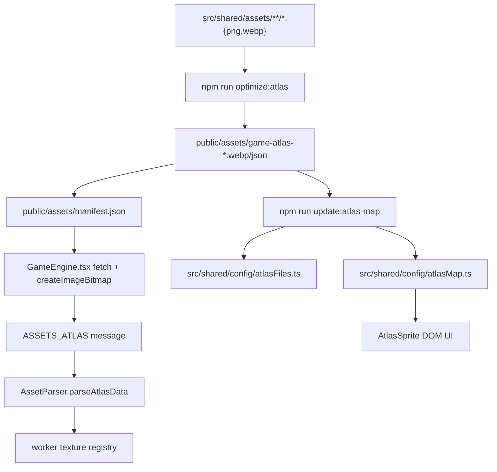

# 에셋 파이프라인

---
status: canonical
owner: engineering
last_reviewed: 2026-05-14
source_paths:
  - .agents/rules/06-asset-guide.md
  - package.json
  - scripts/generate-atlas.mjs
  - scripts/generateAtlasMap.js
  - scripts/optimize-assets.mjs
  - scripts/optimize-ui-icons.mjs
  - public/assets/manifest.json
  - src/shared/assets
  - src/shared/config/atlasFiles.ts
  - src/shared/config/atlasMap.ts
  - src/shared/config/assetConfigValidation.mjs
  - src/app/layout.tsx
  - src/features/game/GameEngine.tsx
  - src/features/game/lib/AssetParser.ts
  - src/shared/ui/AtlasSprite.tsx
  - src/shared/lib/assetUtils.ts
  - src/features/game/ecs/systems/renderers/TileRenderer.ts
  - src/features/game/ecs/systems/renderers/entityMob.ts
  - src/features/game/ecs/systems/renderers/entityProjectile.ts
---

## 목적

이 문서는 원본 이미지 파일이 게임에서 사용할 수 있는 아틀라스 키가 되기까지의 흐름을 설명합니다. 콘텐츠 ID와 이미지 필드의 의미는 `GAME_DATA_MODEL.md`, 렌더 시스템의 세부 동작은 `RENDERING_PIPELINE.md`에서 별도로 다룹니다.

## 정본과 산출물

| 경로 | 성격 | 편집 기준 |
|---|---|---|
| `src/shared/assets/**` | 원본 에셋 | 직접 추가/교체하는 정본입니다. |
| `scripts/generate-atlas.mjs` | 아틀라스 생성기 | 원본 에셋을 `public/assets/game-atlas-*`로 패킹합니다. |
| `scripts/generateAtlasMap.js` | 아틀라스 매핑 생성기 | `public/assets/*.json`을 읽어 `atlasFiles.ts`와 `atlasMap.ts`를 재생성합니다. |
| `public/assets/game-atlas-*.webp` | 생성 산출물 | 직접 편집하지 않습니다. |
| `public/assets/game-atlas-*.json` | 생성 산출물 | 직접 편집하지 않습니다. |
| `public/assets/manifest.json` | 생성 산출물 | 게임이 로드할 아틀라스 JSON 목록입니다. 직접 편집하지 않습니다. |
| `src/shared/config/atlasFiles.ts` | 생성 산출물 | TypeScript에서 쓸 아틀라스 키 목록입니다. 직접 편집하지 않습니다. |
| `src/shared/config/atlasMap.ts` | 생성 산출물 | DOM UI에서 쓸 atlas 좌표 메타데이터입니다. 직접 편집하지 않습니다. |

RAG 관점에서 정본은 원본 에셋, 생성 스크립트, 그리고 이 문서입니다. `atlasFiles.ts`, `atlasMap.ts`, `public/assets/*`는 현재 상태 확인에는 유용하지만 수동 지식 정본으로 삼지 않습니다.

## 현재 폴더 구조

2026-05-14 기준 `src/shared/assets` 아래의 에셋 카테고리는 아래와 같습니다.

| 폴더 | 주 용도 | 대표 키 |
|---|---|---|
| `armors/` | 갑옷 장비 | `CrimsonPlateArmor`, `VoidMantle` |
| `boots/` | 신발 장비 | `CrimsonStrideBoots`, `VoidStep` |
| `drills/` | 드릴 장비 | `CrimsonFangDrill`, `VoidCrusher` |
| `entities/` | 몬스터와 보스 | `Asmodeus`, `Cerberus`, `GaleBat` |
| `essences/` | Essence Effect 아이템 | `LustEssence`, `WrathEssence` |
| `helmets/` | 투구 장비 | `CrimsonVeilHelmet`, `VoidMask` |
| `minerals/` | 인벤토리/UI용 광물 아이콘 | `CrimsonStoneIcon`, `MoldStoneIcon` |
| `relics/` | Relic 또는 제작형 Effect 아이템 | `AsmodeusRingRelic`, `MasterySealRelic` |
| `tiles/` | 월드 타일 이미지 | `StoneTile`, `CrimsonStoneTile` |
| `ui/icons/` | DOM UI 아이콘 | `MoneyIcon.webp`, `InventoryIcon.webp` |
| `vfx/` | 투사체/시각 효과 | `FireBall` |
| `world/` | 플레이어, NPC, 베이스 타일셋 | `Player`, `Merchant`, `BaseTileset` |

삭제된 기능인 Skill Rune, Research, Reliquary Essence용 에셋 폴더나 키를 새 문서에 다시 만들지 않습니다.

## 이름이 아틀라스 키가 되는 방식

기본 규칙은 파일명에서 확장자를 뺀 값이 아틀라스 키가 되는 것입니다.

| 원본 파일 | 기본 키 |
|---|---|
| `src/shared/assets/tiles/CrimsonStoneTile.png` | `CrimsonStoneTile` |
| `src/shared/assets/entities/Asmodeus.png` | `Asmodeus` |
| `src/shared/assets/relics/MasterySealRelic.png` | `MasterySealRelic` |
| `src/shared/assets/vfx/FireBall.png` | `FireBall` |

`scripts/generateAtlasMap.js`에는 예외 매핑이 있습니다.

| 원본 파일 | 매핑 키 | 이유 |
|---|---|---|
| `MoneyIcon.webp` | `GoldIcon` | UI에서는 골드 아이콘 키로 사용합니다. |
| `StatusIcon.webp` | `StatusIcon` | 명시적 UI 아이콘 키입니다. |
| `InventoryIcon.webp` | `InventoryIcon` | 명시적 UI 아이콘 키입니다. |
| `BookIcon.webp` | `BookIcon` | 명시적 UI 아이콘 키입니다. |
| `SettingsIcon.webp` | `SettingsIcon` | 명시적 UI 아이콘 키입니다. |
| `boss_core.png` | `BossCoreTile` | 레거시 snake_case 타일 보정입니다. |
| `boss_skin.png` | `BossSkinTile` | 레거시 snake_case 타일 보정입니다. |
| `EmeralDrill.png` | `EmeraldDrill` | 오타 보정입니다. |

새 에셋은 가능한 예외 매핑 없이 `PascalCase` 파일명으로 추가합니다. 예외 매핑은 기존 저장 데이터나 이미 배포된 키를 유지해야 할 때만 사용합니다.

## 생성 흐름



아틀라스 갱신의 기본 명령은 아래 두 단계입니다.

```bash
npm run optimize:atlas
npm run update:atlas-map
```

`npm run optimize:atlas`는 `scripts/generate-atlas.mjs`를 실행합니다. 이 스크립트는 기존 `public/assets/game-atlas-*.json`, `public/assets/game-atlas-*.webp`, `public/assets/manifest.json`을 삭제한 뒤 새로 생성합니다.

`npm run update:atlas-map`는 `scripts/generateAtlasMap.js`를 실행합니다. 이 스크립트는 생성된 아틀라스 JSON을 읽어 `atlasFiles.ts`와 `atlasMap.ts`를 다시 씁니다.

## `generate-atlas.mjs` 동작

| 항목 | 현재 값 |
|---|---|
| 입력 glob | `src/shared/assets/**/*.{png,webp}` |
| 출력 디렉터리 | `public/assets` |
| 출력 이름 | `game-atlas-{index}.webp`, `game-atlas-{index}.json` |
| 최대 아틀라스 크기 | `2048` |
| padding | `2` |
| extrude | `1` |
| WebP 옵션 | `quality: 90`, `effort: 6`, `lossless: false` |
| rotation | 사용하지 않음 |

생성기는 투명 영역을 alpha 기준으로 trim하고, 가장자리 픽셀을 extrude해서 텍스처 블리딩을 줄입니다. 동일한 픽셀 데이터를 가진 에셋은 content hash로 묶어 중복 패킹을 피하지만, 각 원본 파일명은 frame에 모두 등록됩니다.

아틀라스 JSON의 frame key는 원본 파일명입니다. 예를 들어 `FireBall.png`가 frame key로 들어가고, 런타임 파서는 확장자를 제거한 `FireBall` 키도 추가로 등록합니다.

## 런타임 로딩

`src/app/layout.tsx`는 `public/assets/manifest.json`을 import하고 `validateAtlasManifest`로 검증한 뒤 아틀라스 WebP와 JSON을 preload합니다.

`src/features/game/GameEngine.tsx`는 런타임에 다음 순서로 로드합니다.

1. `${basePath}/assets/manifest.json`을 fetch합니다.
2. `validateAtlasManifest`로 `game-atlas-{n}.json` 형식인지 확인합니다.
3. 각 JSON과 대응 WebP를 병렬 fetch합니다.
4. WebP blob을 `createImageBitmap`으로 디코딩합니다.
5. `ASSETS_ATLAS` 메시지로 atlas JSON, bitmap, base layout, static entities를 worker에 전송합니다.

worker의 `GameEngineInstance.updateAssetsFromAtlas`는 `AssetParser.parseAtlasData`를 호출합니다. `AssetParser`는 각 frame을 아래 키로 등록합니다.

| 등록 키 | 예 |
|---|---|
| 원본 파일명 | `Asmodeus.png` |
| 확장자 제거 키 | `Asmodeus` |
| 플레이어 레거시 키 | `player` |
| 베이스 타일셋 레거시 키 | `tileset`, `baseTileset` |
| 베이스 타일 분할 키 | `tile_base_0`, `tile_base_1`, ... |

Pixi 렌더러는 보통 확장자 제거 키를 사용합니다. DOM UI는 `atlasMap.ts`의 좌표를 읽는 `AtlasSprite`를 사용합니다.

## 데이터 필드 연결

| 데이터 필드 | 연결되는 에셋 키 | 사용 위치 |
|---|---|---|
| `MineralDefinition.image` | 광물 UI 아이콘 | 인벤토리, 상태, 토스트 |
| `MineralDefinition.tileImage` | 광물 타일 이미지 | `TileRenderer` |
| `MonsterDefinition.imagePath` | 몬스터/보스 이미지 | `entityMob` |
| `MonsterDefinition.behavior.projectileId` | 투사체 이미지 의도 | 몬스터 데이터 모델 |
| `Equipment.image` | 장비 이미지 | 인벤토리, 상태, 상점 UI |
| `EffectDefinition.image` | Essence/Relic/제작 Effect 이미지 | 토스트, 제작, 상태 UI |

주의: 2026-05-14 기준 `entityProjectile.ts`는 투사체 렌더링에서 `FireBall.png` 또는 `FireBall`을 직접 사용합니다. 새 투사체 이미지를 데이터에 추가하는 것만으로는 렌더링이 바뀌지 않으므로, 투사체별 이미지가 필요하면 렌더러와 projectile 생성 데이터의 연결을 같이 수정해야 합니다.

## 새 에셋 추가 절차

1. `src/shared/assets` 하위에서 성격에 맞는 폴더를 고릅니다.
2. 파일명을 `PascalCase`로 정하고, 확장자를 제외한 이름이 그대로 코드 키가 되게 합니다.
3. 데이터 파일의 이미지 필드를 새 키로 연결합니다.
4. `npm run optimize:atlas`를 실행합니다.
5. `npm run update:atlas-map`를 실행합니다.
6. `atlasFiles.ts`에 새 키가 있는지 확인합니다.
7. `atlasMap.ts`에 새 키와 좌표가 있는지 확인합니다.
8. UI 또는 렌더러에서 fallback 없이 표시되는지 확인합니다.

대표 연결 예시:

```ts
// src/shared/config/minerals/circle2.ts
{
  key: 'crimsonStone',
  image: 'CrimsonStoneIcon',
  tileImage: 'CrimsonStoneTile',
}

// src/shared/config/equipmentData.ts
{
  id: 'crimson_fang',
  image: 'CrimsonFangDrill',
}

// src/shared/config/effects/items.ts
{
  id: 'mastery_seal',
  image: 'MasterySealRelic',
}
```

## 이미지 최적화 스크립트 주의점

`package.json`의 `optimize:images`는 `scripts/optimize-assets.mjs`를 실행합니다. 이 스크립트는 `src/shared/assets` 아래 PNG/JPG를 직접 덮어쓸 수 있고, 폭 또는 높이가 256px를 넘으면 256px 안쪽으로 resize합니다.

따라서 큰 보스 이미지, 플레이어 애니메이션, 고해상도 UI 원본을 보존해야 하는 작업에서는 `optimize:images`를 기본 절차에 넣지 않습니다. 단순 아틀라스 갱신에는 `optimize:atlas`와 `update:atlas-map`만 사용합니다.

`scripts/optimize-ui-icons.mjs`는 `src/shared/assets/ui/icons`의 PNG를 WebP로 변환하지만 `package.json` script에 연결되어 있지 않습니다. UI 아이콘 변환이 필요할 때만 직접 사용하고, 변환 후 원본 PNG 삭제 여부와 데이터 키를 별도로 확인합니다.

## 변경 지침

- `atlasFiles.ts`와 `atlasMap.ts`를 손으로 고치지 않습니다.
- `public/assets/game-atlas-*`와 `public/assets/manifest.json`을 손으로 고치지 않습니다.
- 에셋 파일명을 바꾸면 데이터 필드의 이미지 키도 같은 변경에서 갱신합니다.
- 삭제된 에셋의 키가 config, UI, 렌더러, 토스트에 남지 않았는지 `rg`로 확인합니다.
- `GoldIcon`처럼 예외 매핑된 키는 원본 파일명이 아니라 매핑 키로 사용합니다.
- base path가 필요한 URL은 `withBasePath` 또는 `getBasePath` 경로를 따라갑니다.
- 새 렌더링 fallback을 추가할 때는 `getSafeTexture`의 기본 `StoneTile` fallback이 의미상 맞는지 확인합니다.

## 검증 명령

문서만 바꾼 경우:

```bash
test -f docs/ASSET_PIPELINE.md
rg -n "ASSET_PIPELINE.md" README.md docs/README.md
```

에셋이나 아틀라스를 함께 바꾼 경우:

```bash
npm run optimize:atlas
npm run update:atlas-map
rg -n "NewAssetKey" src/shared/config/atlasFiles.ts src/shared/config/atlasMap.ts src/shared src/features src/widgets
npm run lint
```

`node_modules`가 없는 작업공간에서는 npm script 검증이 실행되지 않을 수 있습니다. 이 경우 패키지 설치 상태를 먼저 확인합니다.
