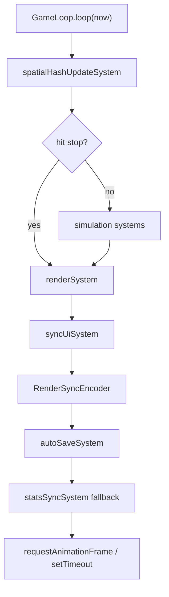

# 코어 게임 루프

---
status: canonical
owner: engineering
last_reviewed: 2026-05-16
source_paths:
  - src/features/game/ecs/systems/GameLoop.ts
  - src/features/game/ecs/systems/ActionSystem.ts
  - src/features/game/ecs/systems/actions/economyActions.ts
  - src/features/input/inputSystem.ts
  - src/features/game/ecs/systems/status/index.ts
  - src/features/game/ecs/systems/physics/index.ts
  - src/features/game/ecs/systems/mining/index.ts
  - src/features/game/ecs/systems/interactionSystem.ts
  - src/features/game/ecs/systems/spawn/index.ts
  - src/features/game/ecs/systems/combat/monsterAiSystem.ts
  - src/features/game/ecs/systems/boss/index.ts
  - src/features/game/ecs/systems/combat/projectileSystem.ts
  - src/features/game/ecs/systems/combat/index.ts
  - src/features/game/ecs/systems/effect/index.ts
  - src/features/game/ecs/systems/tutorialSystem.ts
  - src/features/game/ecs/systems/guideQuestSystem.ts
  - src/features/game/ecs/systems/renderSystem.ts
  - src/features/game/ecs/systems/syncSystem.ts
  - src/features/game/ecs/systems/storageSystem.ts
  - src/features/game/ecs/systems/statsSyncSystem.ts
  - src/features/game/lib/RenderSyncEncoder.ts
  - src/features/game/lib/miningCalculator.ts
  - src/features/game/hooks/useGameWorker.ts
  - src/features/game/hooks/useGameUI.ts
  - src/features/game/hooks/useGameActions.ts
  - src/shared/lib/equipmentRefinement.ts
  - src/shared/lib/effectItemUtils.ts
  - src/widgets/inventory/EquipmentCard.tsx
  - src/features/game/GameEngine.tsx
---

## 목적

이 문서는 워커 내부 `GameLoop`가 한 틱에서 어떤 순서로 시스템을 실행하고, 각 시스템이 어떤 책임을 갖는지 설명합니다. 전체 스레드 구조는 `ARCHITECTURE.md`, 값의 기준은 `GAME_CONSTANTS.md`, 콘텐츠 데이터 참조는 `GAME_DATA_MODEL.md`를 기준으로 합니다.

## 루프 진입점

`GameEngineInstance`가 `GameLoop`를 생성하고 `start()`를 호출하면 `GameLoop.loop(now)`가 반복 실행됩니다. 루프 반복은 `requestAnimationFrame`이 있으면 그것을 사용하고, 없으면 `setTimeout(..., 16)`으로 fallback합니다.



## 실행 순서

`GameLoop.ts` 기준 현재 실행 순서는 아래와 같습니다.

| 순서 | 시스템 | 실행 조건 | 책임 |
|---:|---|---|---|
| 0 | `spatialHashUpdateSystem` | `SPATIAL_HASH_INTERVAL` 경과 시 | 엔티티 공간 분할 그리드를 갱신합니다. hit stop과 무관하게 먼저 실행됩니다. |
| 1 | `inputSystem` | hit stop이 아닐 때 | 키보드/모바일 입력을 `world.intent`로 변환합니다. |
| 2 | `statusSystem` | hit stop이 아닐 때 | 자연 회복, 상태 이상 틱, 행동 차단 상태를 처리합니다. |
| 3 | `physicsSystem` | hit stop이 아닐 때 | 이동 딜레이, 환경 외력, 그리드 이동, 부수 이동 효과를 처리합니다. |
| 4 | `miningSystem` | hit stop이 아닐 때 | 채굴 타겟팅, 타격, 파괴 보상, mastery 경험치를 처리합니다. |
| 5 | `interactionSystem` | hit stop이 아닐 때 | NPC/정적 엔티티 근접 판정과 모달 오픈 요청을 처리합니다. |
| 6 | `spawnSystem` | hit stop이 아니고 `SPAWN_SYSTEM_INTERVAL` 경과 시 | 보스, 일반 몬스터, 스폰 캐시 정리를 처리합니다. |
| 7 | `monsterAiSystem` | hit stop이 아닐 때 | 일반 몬스터의 aggro/attack 상태를 갱신합니다. |
| 8 | `bossBehaviorSystem` | hit stop이 아닐 때 | 보스 전투 진입, 패턴 경고/발동, 보스 UI 상태를 갱신합니다. |
| 9 | `projectileSystem` | hit stop이 아닐 때 | 투사체 이동, 플레이어/타일 충돌, 수명 만료를 처리합니다. |
| 10 | `combatSystem` | hit stop이 아닐 때 | 몬스터/보스 대미지와 사망, 전리품 이벤트를 처리합니다. |
| 11 | `effectSystem` | hit stop이 아닐 때 | 화면 흔들림, 파티클, 플로팅 텍스트, 드롭 수집, 획득 토스트 취합을 처리합니다. |
| 12 | `tutorialSystem` | hit stop이 아닐 때 | 튜토리얼 트리거 조건을 확인하고 메인 스레드에 알립니다. |
| 13 | `guideQuestSystem` | hit stop이 아닐 때 | C2 가이드 퀘스트 진행, 완료, 보상 지급을 처리합니다. |
| 14 | `renderSystem` | Pixi app/layers 준비 시 | 워커 내부 PixiJS 렌더링을 수행합니다. hit stop 중에도 실행됩니다. |
| 15 | `syncUiSystem` | `UI_SYNC_INTERVAL` 경과 시 | Zustand에 반영할 stats/ui/boss/metrics payload를 보냅니다. |
| 16 | `RenderSyncEncoder` | `syncInterval` 경과 및 buffer pool 여유 시 | 메인 스레드 보간용 `RENDER_SYNC` buffer를 보냅니다. |
| 17 | `autoSaveSystem` | 마지막 저장 후 10초 경과 시 | 저장 payload와 tile map buffer를 메인 스레드로 보냅니다. |
| 18 | `statsSyncSystem` | `STATS_SYNC_FALLBACK_INTERVAL` 경과 시 | 이벤트 누락에 대비해 영구 스탯을 재계산합니다. |

## Hit Stop 동작

`now < world.hitStopUntil`이면 시뮬레이션 시스템 대부분을 건너뜁니다.

건너뛰는 시스템:

- `inputSystem`
- `statusSystem`
- `physicsSystem`
- `miningSystem`
- `interactionSystem`
- `spawnSystem`
- `monsterAiSystem`
- `bossBehaviorSystem`
- `projectileSystem`
- `combatSystem`
- `effectSystem`
- `tutorialSystem`
- `guideQuestSystem`

계속 실행되는 흐름:

- `spatialHashUpdateSystem`
- `renderSystem`
- `syncUiSystem`
- `RenderSyncEncoder`
- `autoSaveSystem`
- `statsSyncSystem` fallback

즉 hit stop은 게임 시뮬레이션을 멈추는 장치이지, 렌더링/저장/상태 동기화 전체를 멈추는 장치는 아닙니다.

## 입력과 의도

`inputSystem`은 `world.keys`와 `world.mobileJoystick`을 읽어 `world.intent`를 갱신합니다.

모달 플래그는 메인 스레드 React UI가 소유하지만, 입력 차단은 워커의 `inputSystem`에서 일어나야 합니다. `useGameUI`는 모달 오픈/닫힘과 모바일 모드 변경을 `UI_STATE` 메시지로 워커 `world.ui`에 미러링하고, `inputSystem`은 `isAnyModalOpen(world.ui)`이 true이면 이동/상호작용 의도를 만들지 않습니다.

| 입력 | 결과 |
|---|---|
| 방향키, WASD, ZQSD | `intent.moveX`, `intent.moveY` |
| 모바일 조이스틱 | 임계값을 넘을 때 이동 의도 |
| `Space` | `intent.action = 'interact'` |
| 모달 오픈 또는 플레이어 사망 | 입력 처리 중단 |

이 시스템은 실제 이동을 수행하지 않습니다. 이동은 이후 `physicsSystem`의 `playerDynamics`가 처리합니다.

## 상태, 이동, 채굴

`statusSystem`은 1초 단위 자연 회복, active effect 처리, `STUN`에 의한 행동 차단을 담당합니다. `STUN` 상태면 이동 의도와 채굴 타겟을 지우고 `player.isDrilling`을 false로 만듭니다.

`physicsSystem`은 세 하위 책임으로 나뉩니다.

| 하위 처리 | 역할 |
|---|---|
| `statusEffector` | 상태 이상에 따른 이동 딜레이 변조 |
| `environmentalPhysics` | 보스 환경 외력과 월드 경계 처리 |
| `playerDynamics` | 실제 그리드 이동, 충돌, 시각 위치 보간 |

`miningSystem`은 직접 모든 채굴을 처리하지 않고 아래 흐름으로 위임합니다.

1. `miningTargeter`가 조준 대상과 몬스터 타겟 여부를 판단합니다.
2. 플레이어가 채굴 중이고 유효한 타일 타겟이 있으면 `miningExecutor`가 타격과 파괴를 처리합니다.
3. `miningCalculator`가 장비, 숙련도, 치명타, 보스 relic의 다음 Circle 광물 방어 무시를 반영해 타일 대미지를 계산합니다.
4. 파괴에 성공하면 mastery와 Effect flat bonus로 숙련도 경험치 배율을 계산하고, 보상 수량에는 `statsSyncSystem`이 동기화한 `PlayerStats.luck`을 사용합니다.
5. `masteryService`가 보상과 숙련도 경험치를 적용합니다.

## 상호작용과 액션

`interactionSystem`은 `staticEntities`를 기준으로 플레이어 주변 NPC/오브젝트를 찾습니다. 가까운 대상이 있으면 interaction prompt 상태를 켜고, `intent.action === 'interact'`이면 대상 타입에 따라 메인 스레드로 `OPEN_MODAL` 메시지를 보냅니다.

명시적 UI 액션은 `ACTION` 메시지로 들어와 `GameEngineInstance.handleAction`에서 `ActionSystem`으로 전달됩니다. 메시지 경계의 `isMainToWorkerMessage`는 액션별 payload shape를 먼저 검증하고, `ActionSystem`은 `sell`, `craft`, `rerollEquipmentOption`, `equip`, `synthesizeEffect` 같은 액션을 economy/world 핸들러로 분배합니다.

경제 액션은 UI payload를 신뢰하지 않고 워커에서 다시 검증합니다. 장비 제작은 `EQUIPMENTS[equipmentId].price`를 기준으로 재료를 확인한 뒤 차감하고, 이미 보유한 장비나 부족한 재료는 거부합니다. 광물 판매도 `MINERAL_MAP[resource].basePrice`를 워커에서 다시 조회하며 음수/소수/비수집 광물 요청을 거부합니다. 장비 장착은 해당 장비 ID를 보유 중이고 요청 part와 장비 정의 part가 일치할 때만 허용합니다. waypoint 이동은 해금된 정수 depth만 허용하고, 광고 보상 부활은 사망 상태에서만 처리합니다.

`rerollEquipmentOption`은 장비 재련 액션입니다. `economyActions`가 골드를 소비하고 `equipmentStates[equipmentId].mainStatBonusPct`를 갱신한 뒤 `RECALCULATE_PLAYER_STATS`를 발행합니다. 옵션은 -20~20% 범위의 주스탯 보정이며, 현재 값보다 높은 결과만 적용됩니다. 실제 장비 스탯 반영은 `statsSyncSystem`이 `equipmentRefinement.ts`의 계산 함수를 통해 수행합니다.

스탯이 바뀌는 액션은 `messageBus`의 `RECALCULATE_PLAYER_STATS` 이벤트를 발행할 수 있습니다. `GameEngineInstance`는 이 이벤트를 받아 `syncPermanentStats`와 `forceSyncUi`를 실행합니다.

## 스폰과 적 AI

`spawnSystem`은 매 프레임 실행되지 않고 `SPAWN_SYSTEM_INTERVAL` 기준으로 제한됩니다. 현재 역할은 세 가지입니다.

| 하위 처리 | 역할 |
|---|---|
| `refreshSpawnRulesIfNeeded` | 저장 데이터의 `spawnRulesVersion`이 오래되었을 때 주변 스폰 상태와 레거시 보스 지형을 보정합니다. |
| `bossDirector` | Circle 보스 스폰을 관리합니다. |
| `mobSpawner` | 플레이어 주변 그리드 기반 일반 몬스터 스폰을 관리합니다. |
| `spawnCleaner` | 멀어진 엔티티와 좌표 캐시를 정리합니다. |

`monsterAiSystem`은 일반 몬스터의 상태를 갱신합니다. 플레이어와의 AABB 거리, aggro range, attack range를 기준으로 idle/attack 상태를 바꾸며, 멀리 있는 몬스터는 낮은 빈도로만 검사합니다.

`bossBehaviorSystem`은 현재 살아 있는 보스 하나를 찾아 보스 전투 상태를 관리합니다. 보스가 aggro range 안에 들어오면 `bossCombatStatus`를 갱신하고, 패턴 쿨다운과 warning lead time에 따라 패턴을 발동합니다.

## 투사체와 전투

`projectileSystem`은 type 5 엔티티를 투사체로 보고 다음을 처리합니다.

- 속도 기반 위치 갱신
- 플레이어 AABB 충돌과 대미지 적용
- 타일 충돌 시 제거
- 수명 만료 시 제거

`combatSystem`은 전투 오케스트레이터입니다. 현재 보스 relic의 진행 효과는 전투 처치 hook이 아니라 `miningCalculator`의 다음 Circle 광물 방어 무시로 적용됩니다.

| 단계 | 처리 |
|---|---|
| 1 | `LootGenerator.init()`를 최초 1회 실행합니다. |
| 2 | `damageProcessor`가 상호 타격 판정과 대미지/시각 이벤트를 처리합니다. |
| 3 | `deathHandler`가 사망, 보상 정산, `ENTITY_DIED` 이벤트 발행을 처리합니다. |

`LootGenerator`는 `ENTITY_DIED` 이벤트를 구독해 전리품 생성을 처리합니다. 전투 시스템 자체가 드롭 물리나 수집까지 모두 처리하지는 않습니다. 몬스터 전리품 수량 보너스는 `statsSyncSystem`이 동기화한 최종 `PlayerStats.luck`을 기준으로 계산합니다.

## Effect, 튜토리얼, 가이드

`effectSystem`은 이름과 달리 상태 이상만 처리하는 시스템이 아닙니다. 현재 책임은 화면 흔들림 감쇠, 파티클, 플로팅 텍스트, 드롭 아이템 물리/수집, 아이템 획득 토스트 취합입니다. Effect 아이템을 수집하면 `RECALCULATE_PLAYER_STATS`를 발행해 luck을 포함한 영구 스탯을 즉시 다시 계산합니다.

Effect 아이템의 `bonus` 필드는 `calculateEffectBonuses`에서 수집 중첩 수만큼 flat stat bonus로 합산됩니다. 보스 relic 방어 무시는 `BOSS_RELIC_DEFENSE_IGNORE_RULES`에 정의된 대상 Circle 광물에만 적용하고, C5+ placeholder relic 효과는 Circle 재설계 전까지 정의하지 않습니다.

`tutorialSystem`은 플레이어 진행 상태를 보고 튜토리얼 트리거를 메인 스레드에 보냅니다. 2026-05-14 기준 환영 가이드가 주된 트리거입니다.

`guideQuestSystem`은 C2 초반 가이드 퀘스트 상태를 보장하고, 관측값 변화로 카운터를 갱신하며, 목표 완료와 보상 지급을 처리합니다.

## 렌더링과 동기화

`renderSystem`은 Pixi app과 layer가 준비된 경우에만 실행됩니다. 세부 렌더링 구조는 `RENDERING_PIPELINE.md`에서 다룹니다.

메인 스레드에 전달되는 상태는 두 갈래입니다.

| 메시지 | 생성 위치 | 용도 |
|---|---|---|
| `SYNC_UI` | `syncUiSystem` | Zustand에 반영할 `stats`, `ui`, `boss`, `metrics` |
| `RENDER_SYNC` | `RenderSyncEncoder` | 메인 스레드 HUD 보간용 `Float32Array` buffer |

`RENDER_SYNC` buffer에는 전체 엔티티 데이터가 아니라 최소 헤더만 들어갑니다.

| index | 값 |
|---:|---|
| 0 | reserved, 현재 0 |
| 1 | timestamp |
| 2 | player visual x |
| 3 | player visual y |
| 4 | screen shake |
| 5 | current hp |
| 6 | max hp |

메인 스레드는 사용이 끝난 buffer를 `RETURN_BUFFER`로 워커에 반환합니다.

## 저장 흐름

`autoSaveSystem`은 10초마다 저장 payload를 만들고 `SAVE` 메시지를 보냅니다.

payload 구성:

- `version`
- `timestamp`
- `stats`
- `position`
- `tileMapBuffer`

메인 스레드는 `SAVE`를 받으면 stats/position은 `saveManager.save`로 저장하고, tile map buffer는 IndexedDB가 가능하면 `gameDB.saveTileMap`으로 저장합니다. 저장이 끝난 buffer는 `RETURN_SAVE_BUFFER`로 워커에 반환됩니다.

저장 데이터 구조와 마이그레이션 정책은 `SAVE_AND_MIGRATION.md`에서 별도로 다룹니다.

## 성능 샘플링

`NEXT_PUBLIC_GAME_LOOP_PERF_LOGS=on`이면 `GameLoop`는 시스템별 실행 시간을 샘플링하고 1초 단위로 `console.table`에 출력합니다. 성능 표에는 section, calls, avgMs, maxMs, totalMs가 포함됩니다.

성능 이슈를 추적할 때는 이 샘플러로 어느 시스템이 시간을 쓰는지 먼저 확인한 뒤, 해당 시스템 문맥에서 수정합니다.

## 변경 지침

- 새 시스템을 `GameLoop`에 추가할 때는 hit stop 중 실행 여부를 먼저 결정합니다.
- 고빈도 처리는 가능하면 `GameWorld`와 TypedArray/Pool 구조 안에서 끝내고, 메인 스레드 메시지를 남발하지 않습니다.
- UI에 필요한 저빈도 상태는 `SYNC_UI` payload에 포함하고, 보간이 필요한 고빈도 값은 `RENDER_SYNC`에 포함할지 검토합니다.
- 전투, 채굴, 보상, 렌더링을 한 시스템에 섞지 않습니다. 기존처럼 오케스트레이터와 specialist 파일로 분리합니다.
- 저장 payload를 바꾸면 `useGameWorker`, `saveManager`, `SAVE_AND_MIGRATION.md`를 함께 확인합니다.

## 검증 명령

문서만 바꾼 경우:

```bash
test -f docs/CORE_GAME_LOOP.md
rg -n "CORE_GAME_LOOP.md" README.md docs/README.md docs/ARCHITECTURE.md
```

게임 루프 코드를 함께 바꾼 경우:

```bash
rg -n "samplePerf|hitStop|syncUiSystem|RenderSyncEncoder|autoSaveSystem|statsSyncSystem" src/features/game/ecs/systems/GameLoop.ts
npx tsc --noEmit
npm run lint
```
