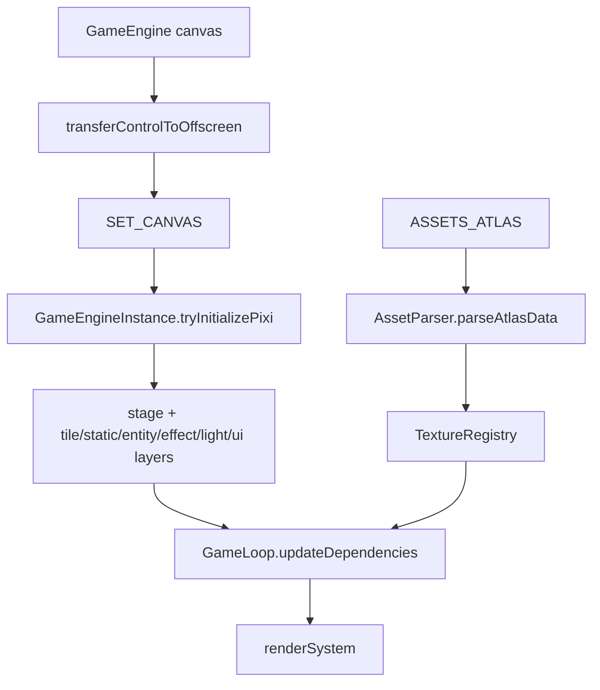

# 렌더링 파이프라인

---
status: canonical
owner: engineering
last_reviewed: 2026-05-14
source_paths:
  - src/features/game/GameEngine.tsx
  - src/features/game/hooks/useGameWorker.ts
  - src/features/game/worker/WorkerMessageRouter.ts
  - src/features/game/worker/GameEngineInstance.ts
  - src/features/game/ecs/systems/GameLoop.ts
  - src/features/game/ecs/systems/renderSystem.ts
  - src/features/game/ecs/systems/entityRenderer.ts
  - src/features/game/ecs/systems/renderers/TileRenderer.ts
  - src/features/game/ecs/systems/renderers/entityPlayer.ts
  - src/features/game/ecs/systems/renderers/entityMob.ts
  - src/features/game/ecs/systems/renderers/entityProjectile.ts
  - src/features/game/ecs/systems/renderers/EffectRenderer.ts
  - src/features/game/ecs/systems/renderers/LightRenderer.ts
  - src/features/game/ecs/systems/renderers/factory.ts
  - src/features/game/ecs/systems/renderers/playerAnimation.ts
  - src/features/game/ecs/systems/renderers/uiComponents.ts
  - src/features/game/lib/AssetParser.ts
  - src/features/game/lib/LightingFilter.ts
  - src/features/game/lib/RenderSyncEncoder.ts
  - src/shared/types/engine.ts
  - src/shared/lib/assetUtils.ts
  - src/shared/ui/AtlasSprite.tsx
  - src/features/game/components/GameOverlay.tsx
---

## 목적

이 문서는 화면이 어떻게 그려지는지 설명합니다. 에셋 생성과 아틀라스 매핑은 `ASSET_PIPELINE.md`, 게임 루프의 시스템 실행 순서는 `CORE_GAME_LOOP.md`, 스레드 경계는 `ARCHITECTURE.md`를 기준으로 합니다.

## 렌더링 책임 분리

현재 렌더링은 두 계층으로 나뉩니다.

| 계층 | 위치 | 책임 |
|---|---|---|
| PixiJS canvas | worker thread | 타일, 플레이어, 몬스터, 투사체, 파티클, 드롭 아이템, 채굴 타겟, 조명 filter |
| React DOM overlay | main thread | HUD, 모달, 보스 체력바, 토스트, 온보딩, 모바일 컨트롤 |

메인 스레드는 Pixi scene graph를 직접 조작하지 않습니다. 메인 스레드는 `<canvas>`를 `OffscreenCanvas`로 worker에 넘기고, worker가 PixiJS를 초기화해 canvas를 직접 렌더링합니다.

## 초기화 흐름



`GameEngine.tsx`는 canvas를 렌더링하고, `transferControlToOffscreen()`으로 canvas 제어권을 worker에 넘깁니다. `WorkerMessageRouter`는 `SET_CANVAS` 메시지를 `GameEngineInstance.setCanvas`로 전달합니다.

`GameEngineInstance.tryInitializePixi`는 worker에서 `PIXI.Application`을 만들고 아래 레이어를 생성합니다.

| 순서 | 레이어 | 현재 역할 |
|---:|---|---|
| 0 | `tileLayer` | 베이스 캠프 타일과 지하 광물 타일 |
| 1 | `staticLayer` | NPC와 정적 오브젝트 |
| 2 | `entityLayer` | 플레이어, 몬스터, 보스, 투사체 |
| 3 | `effectLayer` | 파티클, 플로팅 텍스트, 드롭 아이템 |
| 4 | `lightLayer` | 레이어는 생성되지만 2026-05-14 기준 `renderSystem`에서 직접 사용하지 않습니다. |
| 5 | `uiLayer` | 채굴 타겟 하이라이트 |

CrazyGames 빌드가 아니면 `LightingFilter`를 생성하고 `stage.filters`에 연결합니다. 현재 조명은 별도 `lightLayer`에 그리는 방식이 아니라 stage filter uniform을 갱신하는 방식입니다.

## 아틀라스 파싱과 텍스처 키

메인 스레드의 `loadAssetsAndTransfer`는 `manifest.json`을 기준으로 아틀라스 JSON과 WebP를 fetch하고, WebP를 `createImageBitmap`으로 디코딩해 worker에 보냅니다.

worker의 `AssetParser.parseAtlasData`는 Pixi `Spritesheet`를 parse한 뒤 `textures` registry에 키를 등록합니다.

| 등록 키 | 예 | 용도 |
|---|---|---|
| 원본 파일명 | `Asmodeus.png` | 파일명 기반 fallback |
| 확장자 제거 키 | `Asmodeus` | 대부분의 config 이미지 키 |
| `player` | `Player.png` | 플레이어 레거시 키 |
| `tileset`, `baseTileset` | `BaseTileset.png` | 베이스 타일셋 레거시 키 |
| `tile_base_{id}` | `tile_base_0` | `BaseTileset`을 128px 그리드로 분할한 베이스 캠프 타일 |

DOM UI의 `AtlasSprite`는 Pixi texture registry를 쓰지 않습니다. `atlasMap.ts`의 좌표와 `game-atlas-{index}.webp` 배경 이미지를 CSS background로 사용합니다.

## 프레임 렌더 호출

`GameLoop`는 Pixi app과 layers가 준비된 경우 매 tick에서 `renderSystem`을 호출합니다. hit stop 중에도 `renderSystem`은 계속 실행됩니다.

`renderSystem`의 현재 순서:

| 순서 | 처리 | 파일 |
|---:|---|---|
| 1 | 카메라 위치, zoom, shake 적용 | `renderSystem.ts` |
| 2 | 타일 렌더링 | `TileRenderer.ts` |
| 3 | 플레이어/엔티티 렌더링 | `entityRenderer.ts` |
| 4 | 이펙트 렌더링 | `EffectRenderer.ts` |
| 5 | 채굴 타겟 UI | `renderSystem.ts` |
| 6 | 조명 filter uniform 갱신 | `LightRenderer.ts` |

카메라는 `player.visualPos`를 기준으로 화면 중앙을 맞춥니다. `stage.scale`은 `CAMERA_SCALE`을 사용하고, 화면 흔들림은 `world.shake`에서 난수 offset을 만들어 stage position에 더합니다.

## 타일 렌더링

`TileRenderer.renderTiles`는 플레이어 주변 뷰포트만 렌더링합니다.

| 항목 | 현재 값/정책 |
|---|---|
| 좌우 범위 | 플레이어 기준 약 `-20`에서 `+20` 타일 |
| 상하 범위 | 플레이어 기준 약 `-15`에서 `+15` 타일 |
| 지상 타일 | `world.baseLayout`과 `tile_base_{id}` |
| 지하 타일 | `tileMap.getTile`과 `MINERAL_MAP[tile.type].tileImage` |
| fallback | `StoneTile` |
| 캐시 키 | `{x},{y}_{textureKey}` |

타일은 `tileSpriteCache`와 `tilePool`로 재사용합니다. 뷰포트, `tileMap.renderRevision`, `world.baseLayout`이 변하지 않으면 타일 렌더링을 건너뜁니다.

## 엔티티 렌더링

`entityRenderer.renderEntities`는 세 범주를 처리합니다.

| 범주 | 처리 |
|---|---|
| 플레이어 | `entityLayer`에 `player` container를 만들고 `entityPlayer`가 갱신합니다. |
| SoA 엔티티 | `spatialHash.query`로 플레이어 주변 visible index를 구하고 container pool로 렌더링합니다. |
| 정적 엔티티 | `world.staticEntities`를 `staticLayer`에 id 기준으로 캐시합니다. |

SoA 엔티티의 type이 `5`이면 투사체로 보고 `entityProjectile`을 사용합니다. 그 외에는 일반 몬스터/보스로 보고 `entityMob`을 사용합니다.

엔티티 container는 `factory.ts`에서 만들고, `body`, `hpBar`, `castBar`, `playerCastBar`, `nameTag` 같은 label을 붙인 자식 그래픽을 재사용합니다.

## 플레이어 애니메이션

`entityPlayer`는 `world.intent`와 `player.visualPos`를 보고 idle/walk 프레임을 고릅니다.

| 상태 | 키 선택 |
|---|---|
| idle down | `PlayerWalkDown03` |
| idle up | `PlayerWalkUp03` |
| idle side | `PlayerWalkLeft01` |
| walk down/up/left | `playerAnimation.ts`의 6프레임 clip |
| walk right | left clip을 좌우 반전 |

프레임 간격은 `WALK_FRAME_DURATION_MS = 40`입니다. 스프라이트는 anchor를 `(0.5, 1)`로 쓰고 방향별 `PLAYER_VISUAL_CENTER_OFFSET`을 적용합니다.

## 몬스터, 보스, 투사체

`entityMob`은 `MONSTER_DEFINITIONS[soa.monsterDefIndex[idx]].imagePath`를 texture key로 사용합니다. texture가 없으면 `getSafeTexture`를 통해 `LustfulWhisperer` fallback을 사용합니다. 보스 type은 `2`이며 body tint가 `0xffcccc`로 적용됩니다.

`uiComponents`는 일반 몬스터 HP bar와 캐스팅 bar를 그립니다. 보스 HP bar는 Pixi entity 위가 아니라 React DOM의 `BossHealthBar`에서 별도로 표시합니다.

`entityProjectile`은 2026-05-14 기준 `FireBall.png` 또는 `FireBall`을 직접 사용합니다. `MonsterDefinition.behavior.projectileId`가 있어도 이 렌더러가 아직 projectile별 texture key를 읽지는 않습니다. 새 투사체 에셋을 추가할 때는 이 연결을 먼저 수정해야 합니다.

## 이펙트 렌더링

`EffectRenderer.renderEffects`는 세 흐름을 처리합니다.

| 흐름 | 데이터 | Pixi 객체 | 재사용 정책 |
|---|---|---|---|
| 파티클 | `world.particlePool` | `PIXI.Graphics` | inactive 시 pool 반환 |
| 플로팅 텍스트 | `world.floatingTextPool` | `PIXI.Text` | inactive 시 pool 반환 |
| 드롭 아이템 | `world.droppedItemPool` | `PIXI.Sprite` | inactive 시 destroy |

드롭 아이템 texture key는 우선 `MINERAL_MAP[type].image`, 다음 `EFFECT_DATA[type].image`, 마지막으로 `${type}_icon`을 사용합니다. 실제 texture fallback은 `getSafeTexture(textures, iconKey, 'StoneTile')`입니다.

## 조명

`LightingFilter`는 PixiJS v8 filter입니다. `LightRenderer.renderLighting`은 현재 `darkness = 0`, light list `[]`로 uniform을 갱신합니다.

즉 shader와 uniform 구조는 준비되어 있지만, 2026-05-14 기준 화면 암전이나 동적 광원 효과는 실질적으로 꺼져 있습니다. CrazyGames 빌드에서는 `LightingFilter` 자체를 생성하지 않습니다.

## React DOM overlay

canvas 위에는 `GameOverlay`가 `absolute inset-0 z-20 pointer-events-none`으로 올라갑니다. 내부에서 상호작용이 필요한 HUD, 모달, 모바일 조작 UI만 `pointer-events-auto`를 사용합니다.

DOM overlay의 주요 구성:

| 컴포넌트 | 책임 |
|---|---|
| `BossHealthBar` | 전역 보스 체력바 |
| `Hud` | HP, 자원, 좌표, 빠른 메뉴 |
| `ModalLayer` | 상점, 인벤토리, 상태, 가이드 등 창 |
| `InteractionLayer` | 상호작용 prompt, 사망/부활 화면 |
| `OnboardingOverlay` | 첫 실행 안내 |
| `MobileController` | 모바일 조이스틱과 액션 버튼 |
| `ToastContainer` | 전역 토스트 |

메인 스레드 HUD 위치는 `RENDER_SYNC` buffer를 보간해서 갱신합니다. 메인 스레드는 `view[2]`, `view[3]`을 플레이어 visual position으로 보고 `hudPosition`을 갱신하며, teleport threshold를 넘으면 보간 대신 최신 위치를 사용합니다.

## 변경 지침

- 새 Pixi 렌더러를 추가할 때는 어느 layer에 속하는지 먼저 정합니다.
- 렌더러는 simulation 상태를 변경하지 않고, `GameWorld`와 texture registry를 읽어 시각 객체만 갱신합니다.
- 고빈도 객체는 새로 만들지 말고 container/sprite pool 또는 cache를 사용합니다.
- texture key를 새로 도입하면 `ASSET_PIPELINE.md`와 데이터 필드도 같이 확인합니다.
- `getSafeTexture` fallback이 화면상 의미 있는지 확인합니다. 모든 fallback을 `StoneTile`로 두면 에셋 누락을 숨길 수 있습니다.
- OffscreenCanvas/Pixi 초기화 코드는 main thread DOM API와 worker Pixi API 경계를 섞지 않습니다.
- DOM overlay는 Pixi canvas와 별도 계층입니다. Pixi 객체 위에 React 컴포넌트를 얹는 경우 `RENDER_SYNC` 또는 Zustand 동기화 경로를 명확히 둡니다.

## 검증 명령

문서만 바꾼 경우:

```bash
test -f docs/RENDERING_PIPELINE.md
rg -n "RENDERING_PIPELINE.md" README.md docs/README.md docs/ASSET_PIPELINE.md docs/CORE_GAME_LOOP.md
```

렌더링 코드를 함께 바꾼 경우:

```bash
rg -n "renderSystem|renderTiles|renderEntities|renderEffects|renderLighting|AssetParser|LightingFilter" src/features/game
npm run lint
```

브라우저에서 확인할 때는 canvas가 비어 있지 않은지, HUD가 canvas 위에 정상 배치되는지, 모바일 viewport에서 overlay가 조작 영역을 가리지 않는지 확인합니다.
