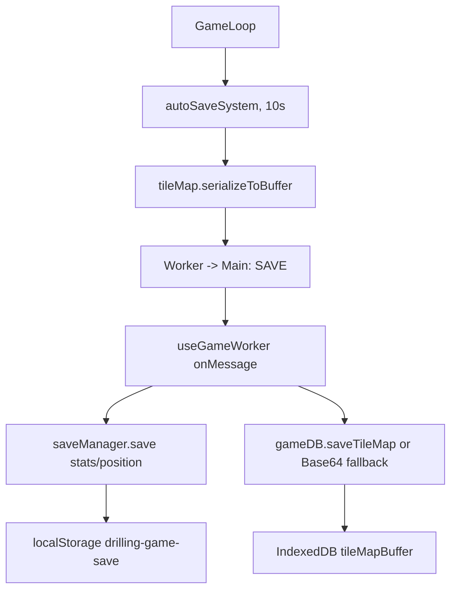
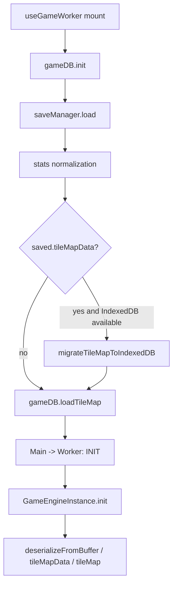

# 저장과 마이그레이션

---
status: canonical
owner: engineering
last_reviewed: 2026-05-16
source_paths:
  - src/shared/lib/saveManager.ts
  - src/shared/lib/db.ts
  - src/shared/lib/equipmentRefinement.ts
  - src/features/game/ecs/systems/storageSystem.ts
  - src/features/game/hooks/useGameWorker.ts
  - src/features/game/hooks/useGameActions.ts
  - src/features/game/worker/WorkerMessageRouter.ts
  - src/features/game/worker/GameEngineInstance.ts
  - src/entities/tile/TileMap.ts
  - src/entities/tile/MapSerializer.ts
  - src/entities/tile/TileMapConstants.ts
  - src/entities/player/model.ts
  - src/entities/world/model.ts
  - src/shared/types/worker.ts
  - src/shared/types/game/player.ts
  - src/shared/types/game/progress.ts
  - src/shared/config/constants.ts
  - src/shared/config/guideQuestData.ts
  - src/shared/config/effects/relics.ts
  - src/features/game/ecs/systems/guideQuestSystem.ts
  - src/features/game/components/ModalLayer.tsx
  - src/widgets/settings/Settings.tsx
---

## 목적

이 문서는 저장 데이터의 위치, 구조, 로드/저장 흐름, 레거시 보정 정책을 설명합니다. 콘텐츠 ID 관계는 `GAME_DATA_MODEL.md`, 저장 관련 상수는 `GAME_CONSTANTS.md`, worker 메시지 경계는 `ARCHITECTURE.md`를 기준으로 함께 확인합니다.

## 저장 위치

현재 게임 진행 저장은 LocalStorage와 IndexedDB로 나뉩니다.

| 저장소 | 키/DB | 저장 대상 | 담당 파일 |
|---|---|---|---|
| LocalStorage | `drilling-game-save` | `version`, `timestamp`, `stats`, `position`, IndexedDB 불가 시 `tileMapData` | `saveManager.ts` |
| IndexedDB | DB `drilling-game-db`, store `save-data`, key `tileMapBuffer` | 타일맵 바이너리 `ArrayBuffer` | `db.ts` |
| LocalStorage | `drilling-game-settings` | 화면 흔들림, SFX, 성능 모드 설정 | `Settings.tsx` |

`drilling-game-save` 값은 JSON을 그대로 저장하지 않고 `DRILLING_SECRET_KEY`로 XOR 후 Base64 인코딩한 문자열입니다. 이 처리는 난독화에 가깝고, 보안 저장소로 취급하지 않습니다.

## SaveData 구조

`SaveData`는 `src/shared/lib/saveManager.ts`에 정의되어 있습니다.

| 필드 | 타입 | 저장 위치 | 설명 |
|---|---|---|---|
| `version` | `number` | LocalStorage | 저장 데이터 최상위 버전입니다. 2026-05-14 기준 worker는 `1`을 보냅니다. |
| `timestamp` | `number` | LocalStorage | 저장 시각입니다. |
| `stats` | `PlayerStats` | LocalStorage | 플레이어 진행, 인벤토리, 장비, 숙련도, Effect, 보스/가이드 상태입니다. |
| `position` | `Position` | LocalStorage | 플레이어 논리 위치입니다. |
| `tileMap` | object | legacy | 구버전 객체형 타일맵입니다. |
| `tileMapData` | Base64 string | legacy/fallback/export | 바이너리 타일맵을 Base64로 인코딩한 값입니다. |
| `tileMapBuffer` | `Uint32Array` | memory only | worker에서 main으로 전달하는 저장 직전 타일맵 버퍼입니다. 디스크에 직접 JSON 저장하지 않습니다. |

`SaveData.version`과 타일맵 바이너리 헤더의 버전은 별개입니다. 현재 `SaveData.version`은 `1`, `MapSerializer`의 바이너리 포맷 버전은 `2`입니다.

## 자동 저장 흐름



`autoSaveSystem`은 `now - lastSaveTime > 10000`일 때 `SAVE` 메시지를 보냅니다. `src/shared/config/constants.ts`에도 `SAVE_INTERVAL = 10000`이 있지만, 2026-05-14 기준 `autoSaveSystem`은 이 상수를 import하지 않고 literal `10000`을 사용합니다.

worker가 보내는 payload:

```ts
{
  version: 1,
  timestamp: Date.now(),
  stats: world.player.stats,
  position: world.player.pos,
  tileMapBuffer: world.tileMap.serializeToBuffer(),
}
```

메인 스레드의 `useGameWorker`는 `SAVE`를 받으면 먼저 `tileMapBuffer`를 뺀 나머지 `version/timestamp/stats/position`을 `saveManager.save`에 넘깁니다. 타일맵은 IndexedDB가 가능하면 `gameDB.saveTileMap`, 불가능하면 `saveManager.save(payload)`의 Base64 fallback 경로로 저장됩니다.

## 로드 흐름



로드 시 순서:

1. 메인 스레드에서 `gameDB.init()`을 실행합니다.
2. `saveManager.load()`가 `drilling-game-save`를 읽고 난독화를 해제합니다.
3. `saveManager.load()`가 구버전/오염 데이터 보정을 수행합니다.
4. IndexedDB가 가능하고 `saved.tileMapData`가 있으면 `migrateTileMapToIndexedDB`를 실행합니다.
5. IndexedDB에서 `tileMapBuffer`를 로드합니다.
6. `INIT` 메시지로 `seed`, `saveData`, `tileMapBuffer`를 worker에 보냅니다.
7. worker는 `tileMapBuffer`, `tileMapData`, `tileMap` 순서로 타일맵을 복원합니다.

worker 복원 우선순위:

| 우선순위 | 필드 | 복원 함수 |
|---:|---|---|
| 1 | `tileMapBuffer` | `TileMap.deserializeFromBuffer` |
| 2 | `tileMapData` | Base64 decode 후 `TileMap.deserializeFromBuffer` |
| 3 | `tileMap` | `TileMap.deserialize` |

복원 시 `stats.mapSeed`와 `stats.dimension`을 타일맵에 같이 넘겨 generator 기준을 맞춥니다.

## 타일맵 바이너리 포맷

`TileMap.serializeToBuffer`는 변경된 타일만 `Uint32Array`로 저장합니다. 전체 맵을 저장하지 않습니다.

현재 version 2 포맷:

| index | 의미 |
|---:|---|
| `0` | 타일맵 바이너리 포맷 버전, 현재 `2` |
| `1` | legacy `MAP_WIDTH`, 현재 `0` |
| `2` | 변경된 타일 수 |
| `3` | reserved, 현재 `0` |

이후 레코드는 타일 하나당 3개 `Uint32`입니다.

| 순서 | 값 | 설명 |
|---:|---|---|
| 1 | `x` | signed int32로 복원합니다. 음수 x는 `x >>> 0`로 저장됩니다. |
| 2 | `y` | 타일 y 좌표입니다. |
| 3 | `packed` | tile type, hp, generated/modified flag가 bit packing된 값입니다. |

`packed` bit 기준은 `TileMapConstants.ts`입니다.

| 상수 | 의미 |
|---|---|
| `TYPE_MASK = 0xff` | tile type id 영역 |
| `HP_BITS = 8` | HP가 시작되는 bit offset |
| `HP_MASK = 0xffff` | HP 영역 |
| `GEN_FLAG = 1 << 24` | 생성된 타일 |
| `MOD_FLAG = 1 << 25` | 수정된 타일 |
| `SPOT_FLAG = 1 << 26` | 특수 spot flag |

version 1 이하 legacy buffer는 `savedMapWidth`, `savedIndex`, `packed`를 사용해 x/y를 복원합니다. 더 오래된 객체형 `tileMap`은 `"x,y": [typeId, health]` 형태를 `deserializeObject`로 복원합니다.

## 마이그레이션과 정규화

`saveManager.load()`는 저장 데이터를 읽을 때 아래 보정을 한 번 수행합니다.

| 처리 | 목적 |
|---|---|
| 누락 필드 기본값 보정 | `equipmentStates`, `ownedEquipmentIds`, `killedMonsterIds`, `refinerySlots`, `activeSmeltingJobs`, `tileMastery`, `unlockedMasteryPerks`, `collectionHistory`, `spawnRulesVersion`을 보장합니다. |
| 장비 재련 상태 보정 | 구버전 장비 숙련도 상태를 `mainStatBonusPct`가 있는 현재 `EquipmentState`로 보정하고, 값은 -20~20 정수 퍼센트로 제한합니다. |
| waypoint 정규화 | `maxDepthReached` 기준으로 100m 단위 waypoint를 보정하고 0m을 보장합니다. |
| 수집 가능 광물 정규화 | 비수집 배경 타일이 `discoveredMinerals`나 `tileMastery`에 남아 있으면 제거합니다. |
| 보스 클리어 이관 | `circle_{n}_core` 형태의 legacy artifact 기록을 `clearedCircleIds`로 옮기고 artifact 필드를 삭제합니다. |
| Effect stack clamp | `EFFECT_DATA[itemId].maxStack`을 넘는 `collectionHistory` 값을 줄입니다. |
| Effect ID 이관 | C3 보스 relic은 `relic_beelzebub_needle`에서 `relic_cerberus_fang`으로, C4 보스 relic은 `relic_mammon_coin`에서 `relic_fafnir_hoard`로 기존 수집 기록을 새 ID에 합산합니다. |
| 미출시 C5+ relic 정리 | C5~C9 placeholder relic인 `relic_satan_heart`, `relic_belphegor_eye`, `relic_abaddon_blade`, `relic_leviathan_mirror`, `relic_lucifer_ice`는 로드 시 수집 기록에서 제거합니다. |
| guide quest 정규화 | 완료/보상 ID와 counter/observed 구조를 현재 C2 guide ID 집합에 맞춥니다. |
| inventory 마이그레이션 | `veinstone`을 `crimsonstone`으로 옮깁니다. |
| legacy item 보상 | 더 이상 정의되지 않는 양수 수량 아이템은 1개당 10G로 환산합니다. |
| 신규 광물 초기화 | `MINERALS`에 있는 광물 키가 inventory에 없으면 0으로 채웁니다. |

`guideQuestSystem`은 `stats.guideQuest`가 없는 기존 저장을 추가로 보정합니다. C2 후반 이상인 세이브는 `shouldSkipGuideForLegacySave` 기준으로 가이드를 완료 처리하고, 그 외에는 새 가이드 상태를 만듭니다.

`TileMap.deserializeFromBuffer`와 `TileMap.deserialize`는 복원 후 `migrateGluttonyBackgroundTiles()`를 호출합니다. 이 처리는 C3 전용 배경 타입 도입 이전 세이브의 수정된 `stone` 배경을 `gluttony_stone`으로 승격합니다.

## IndexedDB 마이그레이션

`migrateTileMapToIndexedDB(tileMapDataBase64)`는 LocalStorage에 남아 있는 legacy `tileMapData`를 IndexedDB로 옮기는 1회성 경로입니다.

정책:

1. Base64를 `ArrayBuffer`로 디코딩합니다.
2. `gameDB.saveTileMap(buffer)`로 IndexedDB에 복사합니다.
3. `gameDB.loadTileMap()`으로 다시 읽어 byte length를 검증합니다.
4. 검증 성공 시 LocalStorage 저장 데이터에서 `tileMapData`와 `tileMap`을 삭제합니다.
5. 실패 시 `gameDB.clearTileMap()`으로 롤백하고 LocalStorage 원본을 유지합니다.

IndexedDB를 사용할 수 없는 환경에서는 이 마이그레이션을 실행하지 않고 LocalStorage Base64 fallback을 유지합니다.

## Export, Import, Reset

설정 창의 `Export Save`는 `useGameActions.handleExportSave`를 통해 worker에 `SAVE_REQUEST`를 보냅니다. worker는 현재 월드의 `tileMapBuffer`를 포함한 `EXPORT_DATA`를 보내고, 메인 스레드는 `saveManager.export`로 타일맵 버퍼를 Base64 `tileMapData`로 바꾼 뒤 클립보드에 복사합니다.

`Import Save`는 prompt로 받은 문자열을 `saveManager.import`로 파싱하고, 성공하면 `saveManager.save(imported)` 후 페이지를 reload합니다.

`Reset`은 `saveManager.clear()`를 호출해 LocalStorage 저장을 삭제하고, IndexedDB가 가능하면 `gameDB.clearTileMap()`도 호출합니다.

## 현재 주의점

2026-05-14 기준 코드에서 확인되는 주의점입니다.

| 항목 | 기준 |
|---|---|
| `SAVE_INTERVAL` | `constants.ts`에 있지만 `autoSaveSystem`은 literal `10000`을 사용합니다. 저장 주기를 바꾸려면 둘을 함께 확인합니다. |
| `RETURN_SAVE_BUFFER` | 메시지 타입과 일부 main-thread branch는 존재하지만 `WorkerMessageRouter`는 현재 반환된 저장 버퍼를 재사용하지 않습니다. |
| `tileMapBuffer` 타입 | `SaveData`는 `Uint32Array`를 사용하고, 일부 메시지 branch는 `ArrayBuffer`를 검사합니다. zero-copy 경로를 고치거나 최적화할 때 타입을 먼저 정리해야 합니다. |
| import 경로 | `saveManager.save(imported)`는 `tileMapBuffer`가 있을 때만 IndexedDB 저장을 수행합니다. 외부 세이브 코드의 `tileMapData`를 IndexedDB 환경에서 가져오는 흐름은 수정 전 실제 복원을 검증해야 합니다. |
| `DRILLING_SECRET_KEY` | 키를 바꾸면 기존 LocalStorage 저장 문자열을 복호화할 수 없습니다. |

## 변경 지침

새 `PlayerStats` 필드를 추가할 때:

1. `src/shared/types/game/player.ts`에 타입을 추가합니다.
2. `src/entities/player/model.ts`의 `createInitialPlayer`에 기본값을 추가합니다.
3. 기존 저장과 호환이 필요하면 `saveManager.load()`에 누락 필드 보정을 추가합니다.
4. gameplay system이 매 tick에서 보정하지 않게, 가능하면 로드 시점 1회 보정으로 끝냅니다.

타일 타입 ID나 packing을 바꿀 때:

1. `src/shared/types/game/core.ts`의 tile ID를 확인합니다.
2. `MapSerializer`의 현재/legacy 포맷을 분리해서 유지합니다.
3. 기존 저장의 `packed` 값을 어떻게 해석할지 마이그레이션을 작성합니다.
4. `TileMap.deserializeFromBuffer`에서 복원 후 보정이 필요한지 확인합니다.

저장 위치나 export/import를 바꿀 때:

1. `saveManager.save/load/export/import`를 함께 봅니다.
2. `useGameWorker`의 `SAVE`, `EXPORT_DATA`, 초기 `INIT` 흐름을 같이 수정합니다.
3. IndexedDB 가능/불가 환경을 모두 검증합니다.
4. `RETURN_SAVE_BUFFER`를 실제로 쓰려면 worker 쪽 재사용 정책까지 구현합니다.

## 검증 명령

문서만 바꾼 경우:

```bash
test -f docs/SAVE_AND_MIGRATION.md
rg -n "SAVE_AND_MIGRATION.md" README.md docs/README.md docs/CORE_GAME_LOOP.md docs/ARCHITECTURE.md docs/GAME_CONSTANTS.md
```

저장 코드를 함께 바꾼 경우:

```bash
rg -n "SaveData|SAVE|EXPORT_DATA|tileMapData|tileMapBuffer|migrateTileMapToIndexedDB|serializeToBuffer|deserializeFromBuffer" src
npm run lint
```

수동 확인:

- 새 게임 자동 저장 후 reload
- 기존 LocalStorage 저장 reload
- IndexedDB 사용 가능 환경에서 tile map 복원
- IndexedDB 불가 환경에서 Base64 fallback 복원
- Export Save 후 Import Save
- Reset 후 LocalStorage와 IndexedDB 데이터 삭제
