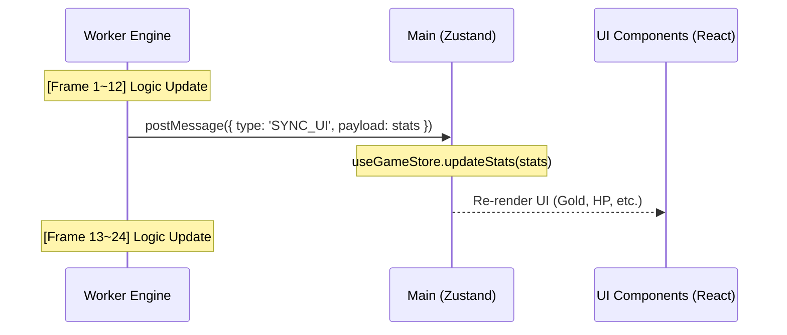

# 💾 상태 관리 (State Management)

Drilling RPG는 성능을 위해 **이분화된 상태 관리(Bifurcated State Management)** 전략을 사용합니다. 모든 게임 상태는 데이터의 성격과 관리 주체에 따라 두 곳으로 나뉩니다.

---

## 1. 전역 상태 관리 구조

### **A. 고성능 물리 및 게임 상태 (Worker Thread)**
- **관리 주체**: `GameWorld` (ECS 데이터 구조체)
- **대상**: 플레이어 위치, 타일 맵 데이터, 엔티티 속성, 물리적 보간 데이터 등.
- **업데이트 주기**: 60Hz (매 프레임)
- **동기화**: 트리플 버퍼링(`Float32Array`)을 통해 메인 스레드 렌더러로 실시간 전송.

### **B. UI 및 영구적 통계 상태 (Main Thread)**
- **관리 주체**: [Zustand](https://github.com/pmndrs/zustand) (`useGameStore`)
- **대상**: 골드 코인, 보석, 인벤토리 아이템, 모달 창(상점, 설정) 열림 여부, 업그레이드 레벨 등.
- **업데이트 주기**: 5Hz (200ms) - 사용자가 시각적으로 인지 가능한 수준에서 동기화.
- **동기화**: 워커에서 `postMessage`를 통해 업데이트된 통계 객체를 수신하여 상태를 덮어씁니다.

---

## 2. Zustand 스토어 (`src/shared/lib/store.ts`)

UI 상태는 리액트 컴포넌트에서 쉽게 구독할 수 있도록 Zustand를 통해 전역적으로 관리됩니다.

```typescript
interface GameState {
  stats: PlayerStats | null; // 플레이어 통계 및 진행 상태
  updateStats: (stats: Partial<PlayerStats>) => void; // 워커 수신 데이터 업데이트
  setStats: (stats: PlayerStats) => void; // 세이브 데이터 로드 시 초기화
}
```

- **성능 이점**: 렌더링에 필요한 물리 데이터와 UI 정보를 분리함으로써 리액트 리렌더링 부하를 대폭 줄입니다.
- **스로틀링(Throttling)**: 워커 스레드(`game.worker.ts`) 내부에서 이미 UI 동기화 간격을 200ms(`uiSyncInterval`)로 제어하여 보내기 때문에, 메인 스레드의 부하가 매우 낮습니다.

---

## 3. 워커-메인 동기화 흐름 (Sync Flow)



---

## 4. 데이터 일관성 가이드

1.  **쓰기(Write)**: 사용자 인터랙션(아이템 장착, 상점 구매 등)은 **메인 스레드**에서 감지되어 워커로 전송됩니다. (`ACTION` 메시지)
2.  **최종 결정(Authority)**: 모든 수치는 워커 내부의 엔진이 최종적으로 결정합니다. (예: 구매 가능 여부 판단 후 골드 차감)
3.  **반영(Reflect)**: 워커에서 결정된 결과값은 다시 `SYNC_UI` 메시지를 통해 메인 스레드로 돌아와 UI를 업데이트합니다.
